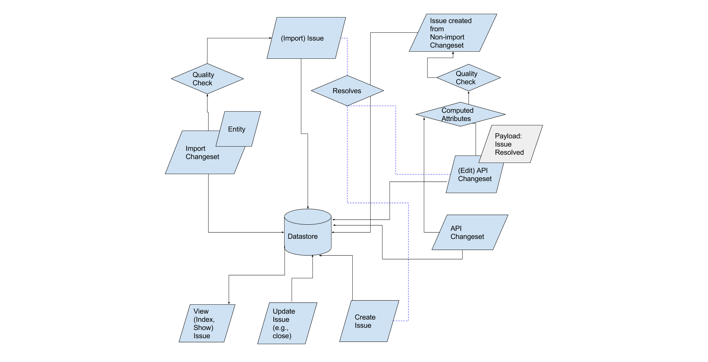

<script src="https://cdn.rawgit.com/knsv/mermaid/0.3.5/dist/mermaid.full.js"></script>

Transit data specifications have rules for populating data field types and referential integrity between those fields,
but often their values are not accurate with regard to the geographical, temporal, or other more subjective characteristics of the data content. For example, GTFS Shape points may be accidentally stored in reverse, or a Feed URL may not point to a GTFS feed. In other words, the quality of the data content is a concern outside of format.


Transitland's Datastore offers a mechanism to check the data quality, create records of quality issues if found, and resolve those issues through Changesets.


## Issue data model

An Issue instance represents a single occurrence of an issue type. This typically means the issue is
associated with one entity and entity attribute, such as a Route's name or Feed's URL. Sometimes, however, the issue type can cover an interrelationship between two or more entities. For example, an issue flagging an unusual distance between a Stop and RouteStopPattern would have an association with both those particular Route and Stop instances.

| Attribute | Type | Description |
|-----------|------|---------|
| `id`      | Number | ID |
| `issue_type` | String | [Category.](#issue_types) |
| `details` | String | Text that describes issue. Automatically or manually added. |
| `created_by_changeset_id` | Number | Changeset, if any, that produced Issue |
| `resolved_by_changeset_id` | Number | Changeset, if any, that resolved Issue |
| `open` | Boolean | The issue is not resolved or no resolution action is necessary. |

Issues are connected to entities through the join table represented by the model EntityWithIssues.

| Attribute | Type | Description |
|-----------|------|---------|
| `id`      | Number | ID |
| `entity_id` | Number | Entity Foreign Key |
| `entity_type` | String | Entity Type |
| `entity_attribute` | String | Attribute field to blame for the issue |
| `issue_id` | Number | Issue Foreign Key |

<a name="issue_types">Example Issue Types</a>

| `issue_type` | Description |
|-----------|------|
| `stop_rsp_distance_gap` | Stop is too far (> 100 meters) from a given RouteStopPattern |
| `distance_calculation_inaccurate` | Stop distances for a given RouteStopPattern are wrong |
| `feed_fetch_invalid_url` | Feed source URL host unavailable (poorly formatted URLs will not be saved on the Feed model ) |
| `feed_fetch_invalid_zip` | Feed source zip file is not structured according to expectations |
| `feed_fetch_invalid_source` | Feed source is not valid according to the GTFS specification |
| `feed_fetch_invalid_response` | Feed fetch on URL returned an HTTP status error |
| `uncategorized` | A catch-all encompassing an Issue type not matching the existing types. |

Through the [Issues API endpoint](https://transit.land/api/v1/issues), an example json response may
look something like this:

```json
{
  issues: [
    {
      id: 227,
      created_by_changeset_id: 1993,
      resolved_by_changeset_id: null,
      imported_from_feed_onestop_id: "f-dre-cdta",
      imported_from_feed_version_sha1: "1c2e1092b1d7efdab4eb68294d85fce8cc08f506",
      details: "Stop s-drescnzve0-racino~sideentrance~canopy and RouteStopPattern r-dret1-875-d0fd5e-9e0c93 too far apart.",
      issue_type: "stop_rsp_distance_gap",
      open: true,
      created_at: "2016-07-23T04:42:35.843Z",
      updated_at: "2016-07-23T04:42:35.843Z",
      entities_with_issues: [
        {
          onestop_id: "s-drescnzve0-racino~sideentrance~canopy",
          entity_attribute: "geometry"
        },
        {
          onestop_id: "r-dret1-875-d0fd5e-9e0c93",
          entity_attribute: "geometry"
        }
      ]
    }
  ]
}
```

## Issue life cycle and deprecation

A consumer of the issues API may wonder why issues having a specific numeric id value may sometimes disappear and reappear with a different id, or how issues even come into being at all.

Issues are created during changeset application, including through feed version imports and the changeset API, and directly through the issues API endpoint. Each changeset application will deprecate - log and delete - any existing issues on the changeset's entities and attributes, and check the data quality of the changeset's entities for new issues to create. In addition, any changeset that resolves an issue can produce new issues not related to the resolving issue.

A typical issue life cycle may run as follows:  

An import creates an issue, e.g. a stop is too far from a route stop pattern. Then the next feed version import, assuming it has the same two stop and route entities with a gap, will remove the previous issue record and create a new one. Now suppose someone submits an issue-resolving changeset that moves the stop location closer to the route. The changeset application closes and deprecates the issue. The next import will not produce the same issue
because the stop geometry will remain unmodified from the incoming data.     

The [Changesets section](changesets.html) describes the issue life cycle within a changeset in more detail.

<!--  -->

### Issues outside of changesets

Issues can also be generated outside of the changeset process, either through backend services or directly
through the [Issues API endpoint](https://transit.land/api/v1/issues). On the backend, two examples of services where issues are created are in the stop conflation service and the feed fetcher service.
