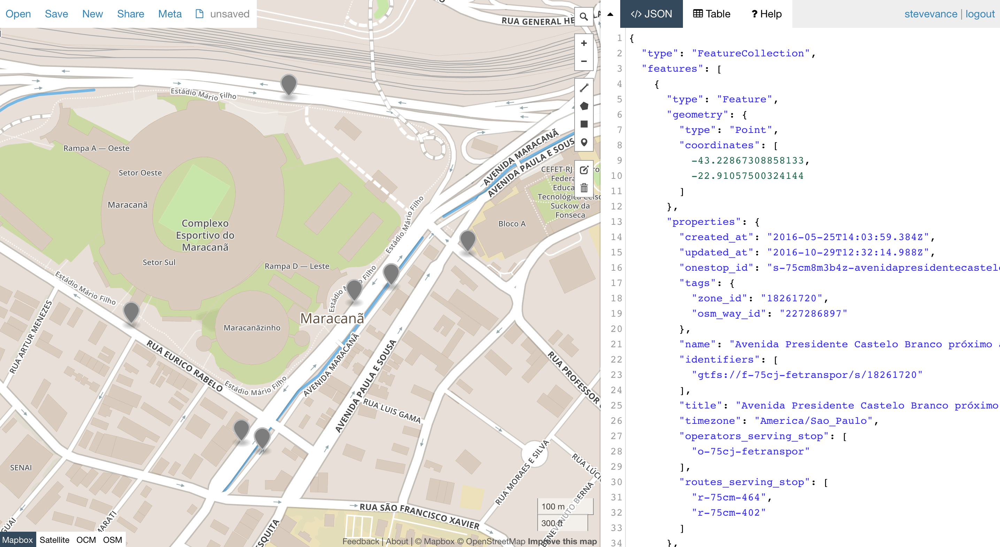
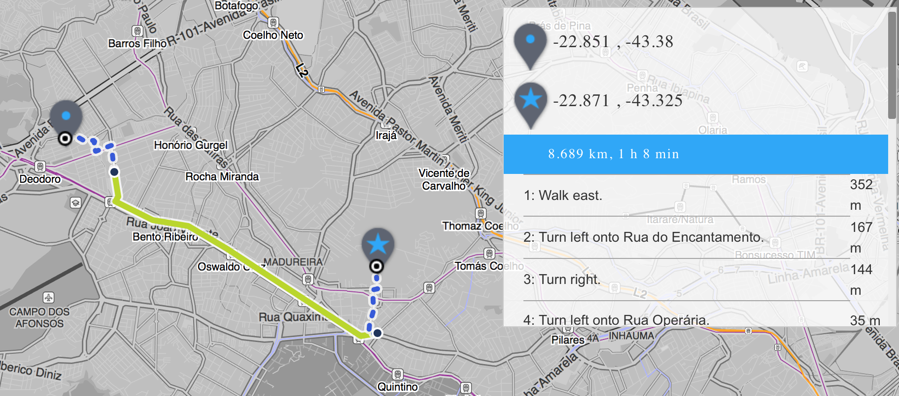

# Use Transitland's API to make a map of nearby transit stops

Transitland's API unwraps our vast datastore of transit schedules from around the world – contributed by many – which can be included in your apps and maps. It's possible to start in the browser, however, to see the possibilities before you create your map or app. 

This tutorial will walk you through **creating a map of transit stops near a given location**. You can choose any distance, but to show walking distance you'll want to show only those within 400 meters (about a quarter mile) of a starting point. 

## Why make this map

- You're a business owner and you want to add a map to your website that shows that it's possible to walk to your shop from one of several bus stops or train stations. 
- By knowing how many transit stops are within walking distance of people's homes you can begin to analyze accessibility to transit

## Find your starting location

First, you'll need to know the latitude and longitude coordinates of the starting place. If you're starting at [Fontana di Trevi](http://www.openstreetmap.org/way/23322002#map=19/41.90097/12.48328) in Rome, Italy, the latitude is 41.90097 and the longitude is 12.48328. 

The [Maracanã Stadium](http://www.openstreetmap.org/relation/4587734#map=18/-22.91209/-43.23013) in Rio de Janeiro, Brasil, is at -22.91210, -43.22919. 

Find the coordinates for any place in the world on [Mapzen's "I am here" website](https://whosonfirst.mapzen.com/iamhere/#7/38.514/-98.320). 

### Make your first API request

Once you have that information it's easy to create a Transitland API request using the `stops` endpoint that looks for all transit stops (no matter the mode) within a specified distance from your given point, where we have coverage. I've chosen the Maracanã Stadium's location. 

````
https://transit.land/api/v1/stops?lat=-22.91210&lon=-43.22919&r=400
# "lat" is short for latitude
# "lon" is short for longitude
# "r" is the attribute for radius, in meters
````

Go ahead and paste that query URL in your web browser's location bar and press "Enter". A moment later a block of text will appear that looks like this:

````
{"stops":[{"identifiers":["gtfs://f-75cj-fetranspor/s/18232257"]: [snipped]
````

This particular call returns seven stops in a JSON-formatted response. The `meta` property contains pagination information and describes how your request was sorted, and which "page" of results it contains. 

### Put your results on a map

Now it's time to see what this looks like on a map, in under a minute. 

1. In your web browser, go to [http://geojson.io](http://geojson.io). 
2. Then, open the downloaded file in a text editor (like Notepad on Windows, or TextEdit on Mac). 
3. Copy the text from the text editor. 
4. Paste it into the text area on the right half of *geojson.io*.
5. A map appears on the left half! (This may take longer if you have more than 100 points.)

If you really are that business owner and you want to embed this map on your shop's website, you can grab a special URL from *geojson.io*. 



### Embed your map
On *geojson.io*, with your transit stops marked, click on the *Share* button above the map. A dialog box will appear with a URL to a full-screen view of your map. Copy that URL and paste it into the embed code below. 

````
<iframe src="[insert URL here]"></iframe>
````

Now copy this `<iframe>` embed code into the HTML of your website where you want the map to appear and save that page. 

## Try more options

### Create a more advanced API request

By default, the API returns 50 results. You can increase the number of results in a response to 1,000 by adding `&per_page=1000` to the URL. If you request this many results in your web browser, it may be unable to load all of the results. 

Since our API request only returned seven stops, we don't need to increase the `per_page` attribute. 

One very helpful attribute that I add to most requests is `total=true`. Add this, preceded by an ampersand, of course, and the JSON response will include a property with the number of results in the response. This can save you the time of having to load the JSON response into a program that can count the results for you. 

Now our query URL looks like this:

````
https://transit.land/api/v1/stops?lat=-22.91210&lon=-43.22919&r=400&total=true
````

There are a couple other parameters we can add to this request that can narrow our results. The GTFS specification that all of the transit feeds in our datastore allows transit operators to specify if a stop allows wheelchair boarding. This is most important to transit routes that use trains or bus-rapid transit (BRT) because their stations may not yet be equipped.

Add these parameters to your query URL `&tag_key=wheelchair_boarding&tag_value=1`, making the query URL look like this:

````
https://transit.land/api/v1/stops?lat=-22.91210&lon=-43.22919&r=400&total=true&tag_key=wheelchair_boarding&tag_value=1
````

Visit that URL in your web browser and press "Enter". It turns out that the response is empty, and returned zero stops! Now, that doesn't mean that none of the stops are wheelchair accessible at this point, because not all operators have applied this property to their transit data. However, a `tag_value=1` means that this stop *definitely* has wheelchair-accessible boarding. Let's remove that latest addition to the query URL. 

### Check for routing capabilities

The next useful parameter to add will filter for stops that we've imported into our datastore in a way that prepares the data for Valhalla, our open source turn-by-turn routing service. Add the `import_level=4` parameter to the URL to get that. 

````
https://transit.land/api/v1/stops?lat=-22.91210&lon=-43.22919&r=400&total=true&import_level=4
````

All 7 stops from our first API request are back, meaning we can ask the Valhalla routing service to give us directions on how to get from point A to point B in Rio de Janeiro via transit. [Open a Valhalla demo in Rio](http://valhalla.github.io/demos/routing/multimodal.html#loc=13,-22.914584812068586,-43.44649824378031) and click on two points. 



### Export API requests as GeoJSON

The last step is to output this data so that we can map it. You can output any of the Transitland API requests as **GeoJSON**, a human-readable and standard way to represent places. 

Add `.geojson` after the `stops` endpoint parameter in the query URL, like this:

````
https://transit.land/api/v1/stops.geojson?lat=-22.91210&lon=-43.22919&r=400&total=true
````

Insert that URL in the web browser and press "Enter". A file called `stops.geojson` will download to your computer. (If you're accessing the API through an app you're building, the file won't be downloaded.)

### Advanced mapping

With the GeoJSON file, you can visualize the transit stops in more maps and applications. 

- You can open this file in the open source desktop application [QGIS](http://qgis.org)
- [Add the data to a Leaflet map](http://leafletjs.com/examples/geojson/) to embed on your website
- [Call the Transitland API](https://transit.land/news/2016/08/11/transit-in-rio-olympics-copy.html) with Mapzen's Tangram Play product
- [Use the file](https://www.mapbox.com/help/uploads/) in a [Mapbox map](https://www.mapbox.com/help/creating-new-map/)
- Upload that GeoJSON file directly to [Carto](https://carto.com/blog/github-geojson-and-cartodb/), which requires you to create a free account

<iframe src="http://bl.ocks.org/anonymous/raw/ee1f134355fd5a7e1a13a698b3d5f8b7/"></iframe>